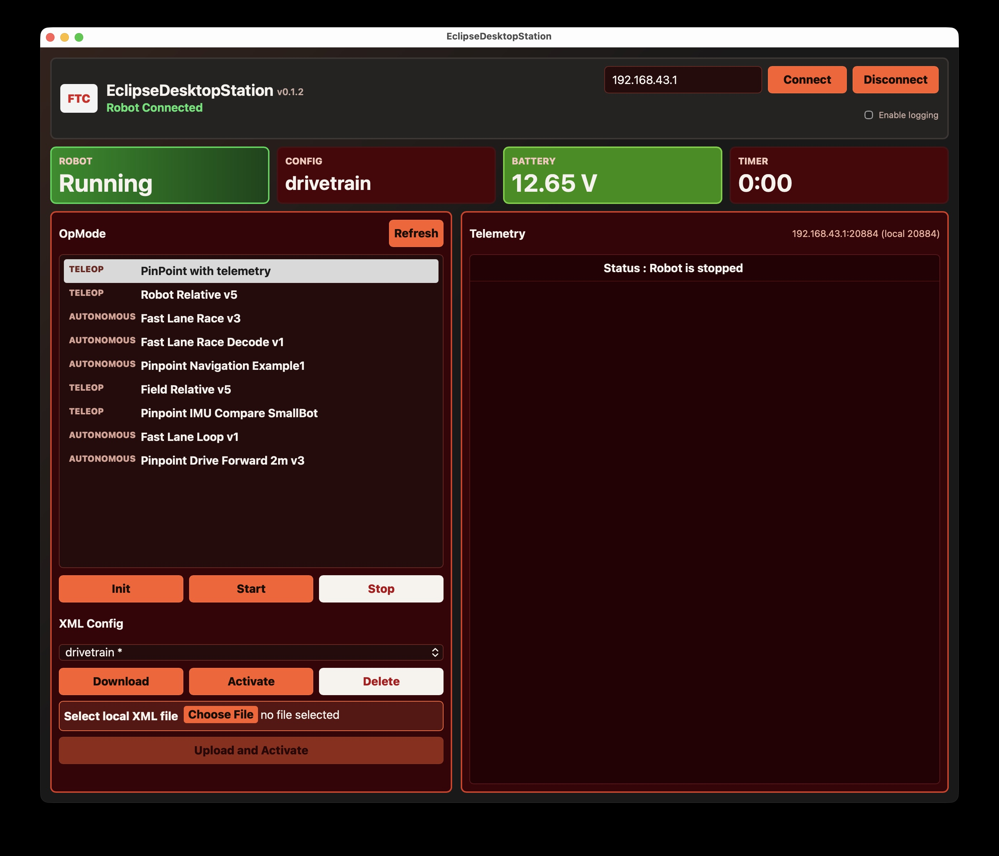

# EclipseDesktopStation

Virtual Driver Hub app similar to REV's.

This is a Tauri + Rust app that connects to a Robot Controller over the FTC
Robocol UDP protocol. Targets FTC SDK 11.1 (Robocol version 124). Intended for
practice and diagnostics — **not for official competition use**.



## Features

- Connect to a Robot Controller by IP address.
- Heartbeat/keepalive traffic to maintain the Robocol session.
- OpMode list with Init, Start, and Stop lifecycle controls.
- Robot state, battery, active config, and practice timer.
- Telemetry display (preserves packet order; shows unnamed rows).
- Detects when another Driver Station is already connected and greys out.
- Surfaces robot errors and toasts (OpMode uncaught exceptions, etc.).
- XML config management:
  - Browse and select configs from a dropdown (active config marked `*`).
  - Download a config to `~/Downloads`.
  - Activate any config on the hub.
  - Upload a local XML file (activates on save — RC behavior).
  - Delete configs.
- JSONL session logs written to the OS log directory for field debugging.

## Download

Pre-built installers for macOS, Linux, and Windows are on the
[Releases](../../releases) page. Download the file for your OS and run it —
no Rust or Node.js required.

> **macOS note:** The app is not yet notarized. On first launch, right-click
> the app and choose **Open** to bypass Gatekeeper.

## Development

### Requirements

- Node.js + npm
- Rust toolchain (`rustup`)
- Tauri 2 system dependencies for your OS
  ([see Tauri docs](https://v2.tauri.app/start/prerequisites/))

### Run locally

```bash
npm install
npm run tauri:dev
```

### Common checks

```bash
npm run build
cd src-tauri && cargo check
cd src-tauri && cargo fmt
```

### Build a release binary

```bash
npm run tauri:build
```

Artifacts land in `src-tauri/target/release/bundle/`.

### Regenerate icons (if you change `icon_source.png`)

```bash
npx @tauri-apps/cli icon src-tauri/icons/icon_source.png
```

## Project Layout

```
src/
  main.js          — frontend UI and Tauri command calls (vanilla JS)
  styles.css       — FTC Driver Station-inspired dark layout
src-tauri/
  src/
    lib.rs         — Tauri command surface and app state
    robocol.rs     — UDP Robocol client: packets, heartbeat, telemetry, commands
    xml_config.rs  — XML validation and Downloads save path
    debug_log.rs   — per-session JSONL logging (non-fatal, OS log dir)
  icons/
    icon_source.png — 1024px source icon (regenerate set with tauri icon)
  tauri.conf.json
```

## Debug Logs

Session logs are written to:

| OS      | Path |
|---------|------|
| macOS   | `~/Library/Logs/EclipseDesktopStation/session-<ts>.jsonl` |
| Linux   | `~/.local/state/EclipseDesktopStation/logs/session-<ts>.jsonl` |
| Windows | `%LOCALAPPDATA%\EclipseDesktopStation\logs\session-<ts>.jsonl` |

The log path is shown in the app's top bar. Logging is best-effort — the app
runs normally even if the log directory cannot be created.

Key event names: `connect`, `disconnect`, `tx_command`, `rx_command`,
`rx_telemetry`, `robot_stacktrace`, `robot_toast`, `peer_discovery`,
`save_config_xml`, `activate_config`, `delete_config`.

## Protocol Notes

- Robocol UDP port: `20884`
- Robocol version: `124` (FTC SDK 11.1)
- Default Control Hub IP: `192.168.43.1`
- If local port 20884 is in use, the app falls back to an ephemeral port
  (shown in the telemetry panel header).

## Known Limitations

- No gamepad input — this is a practice console, not a driving station.
- macOS releases are not notarized (no Apple Developer account required to
  build, but first-run requires right-click → Open).
- Linux uses the system WebKit2GTK runtime. The `.AppImage` bundles most of
  what's needed; `.deb` installs the dependency via apt.
- Windows and Linux runtime behavior is CI-tested but not yet live-tested
  against a physical Control Hub.

## License

MIT — see [LICENSE](LICENSE).
